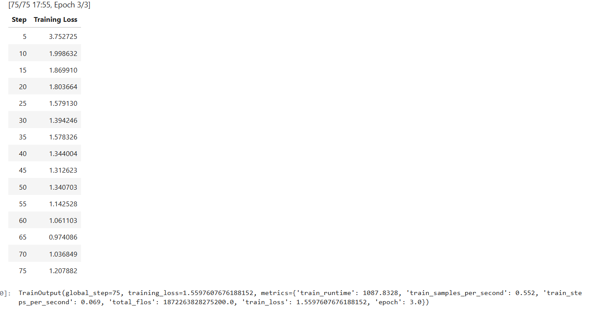
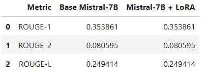
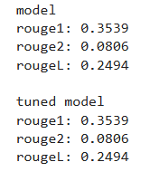

# Circle_Limited

Проект по дообучению языковой модели **Mistral-7B-Instruct-v0.2** с использованием **LoRA / QLoRA**.

## 1. Подготовка датасета

В качестве исходного датасета использовал:

- `tatsu-lab/alpaca` — около 52 000 примеров

После фильтрации и дедупликации было отобрано **250 примеров**. Затем были преобразованы в более короткий и единообразный стиль.

Датасет сохранён в формате JSONL:

```text
dataset_final.jsonl
```

Получается я подготовил данный потом синтезировал данный с помощью модели и переобразил на единый формат `instruction-response`.


## 2. Fine-Tuning

Для обучения использовалась модель:

`mistralai/Mistral-7B-Instruct-v0.2`
Обучение выполнялось с использованием:
- Transformers
- PEFT
- TRL
- QLoRA
- 4-bit NF4 quantization

Так модель Mistral-7B не помещалась в доступную GPU-память при обычном fine-tuning.
Я использовал QLoRA: базовая модель загружалась в 4-bit NF4, а обучалось на LoRA-адаптера и использовался gradient accumulation.

  

Как видите Loss снизился во время обучения. В конце небольшое увеличение training loss

## 3. Evaluation

Для сравнения использовались 15 тестовых инструкций и сравнивались:

- Base Mistral-7B;
- Mistral-7B + LoRA adapter.

Для оценки я использовал ROUGE
### Результаты
  

По наблюденного 15 выбранных для тестовых запросах ответы Base и Fine-tuned моделей оказались идентичными. Поэтому значения ROUGE также не изменились.

 

## 4. Вывод
Главный обсуждения этого задачи, fine-tuning с QLoRA и сохранённым адаптером, а также зафиксированные ограничения и результаты evaluation. Как видите решил выбор целевого стиля атаки, анализ и анализ набора данных вручную, интерпретация кривой потерь и оценки результатов
